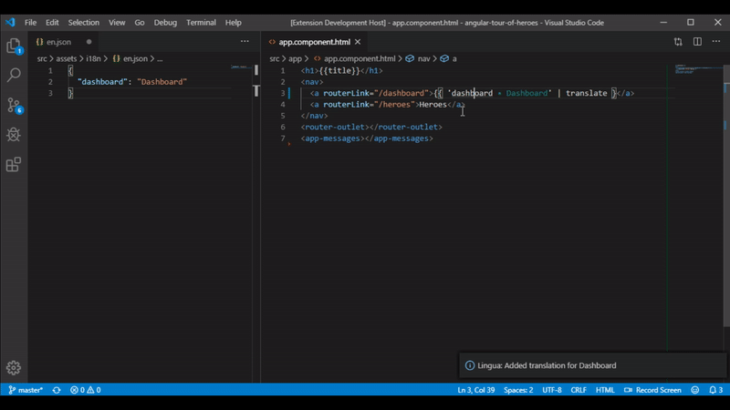

# Lingua: Managing nxg-translations

Lingua - a Visual Studio Code extension to help managing translations for [ngx-translate](https://github.com/ngx-translate/core) - a internationalization (i18n) library for Angular.




## Goals:

Lingua's goals is to help developers creating, and managing translations with ngx-translate, right in the editor. With Lingua you can:

-   Create translations from the context menu
-   Show the default translation of an identifier when hovering over it
-   Find a translation in your lang-file from an identifier
-   Analyse translation usage (e.g. how many translations, how many unused translations, ...)
-   Delete unused translations

## Usage:

Lingua is automatically started when you work on an Angular project. But to use its features you first have to specify at least one language file (e.g. `en.json`, `de.json`, ...)

This is done by opening the [language].json file in the editor and selecting right-click context menu "_Set as language file_". Enter the language identifier, which you want to use (e.g. `en`) in the quick promt field. Lingua automatically creates a `.lingua` settings file in the root of your project.

> The first file you set as a language file will be your default language. This means mouse-over translations are generated from this language file. You can change the default in the settings with the `defaultLanguage` parameter

### Creating new translations

Write an identifier in your code like `'some.identifier'` for which you want to create a translation. Select or the identifier or place the cursor in it and open the context menu with right-click. Select `Lingua: Create translation`. You will be promted to enter a translation for this identifier, following with a promt to select the language for which you want to create this translation for.

### Changing translations

### Go to a translation in your default language file

Select or an identifier or place the cursor in it and open the context menu with right-click. Select `Lingua: Go to translation` to get to the correct location in the default language file.

### Analysing translation usage

Hit `Ctrl+P` and enter the command `Lingua: analyse translation usage` to calculate some metrics about translations in your project. Metrics include:

-   Total amount of translations for each defined language
-   Total amount of partial translations
-   Ununsed or missing translations (translations that are not used in the project)

> Partial translations are identifiers that are resolved during runtime, e.g. in `'someIdentifier.${parameter}'` the word `someIdentifier` is recognized as a partial path in the translation.

### Configuration

Lingua needs at least the location of one language file in order to work. If this file is selected a `.lingua` settings file will be created in the root of the project. There are some settings available to customize the use of the extension:

```typescript
defaultLang: string;

// A keywordfor the language file that is used as default translation.
// For example: 'en', 'de' or 'fr'
```

```typescript
translationFiles: {
    lang: string;
    uri: Uri;
}
[];

// Key-value-pair of a language key (see defaultLang) and the uri to its language file.
// Is filled when a language file is added.
```

```typescript
analysisFiles:  string[]

// List of filetype endings that are included in the analysis. Default is ['ts','html']
```

## Planned features:

-   [ ] Sync multiple lang-files
-   [ ] Import/Export Translations
